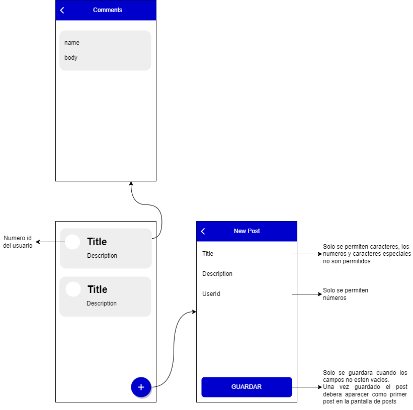

# Introducción 
Este repositorio es una base que se utilizará durante la entrevista de Flutter mobile. Lea los siguientes pasos para preparar su entorno para la entrevista y ¡buena suerte!

# Antes de Empezar
*	Si aún no tienes instalado el entorno Flutter, sigue la documentación oficial para instalarlo.
    * La versión con la que se creó el proyecto es: Flutter 2.10.2 y Dart 2.16.1.
*	Clone este repositorio https://SCFG@dev.azure.com/SCFG/Fassil/_git/flutter-test
*	Compruebe que puede ejecutar el proyecto normalmente, de una de las siguientes maneras
    * Utilizar la ejecución de su IDE/editor de código preferido.
    * Desde el terminal, con el comando flutter run.

# Dinámica 
La prueba tiene una duración de 5 días desde que se le compartió el link del repositorio. Esto no quiere decir que tiene que enviar el resultado de la prueba dentro de 5 días, puede enviarlo cuando tenga resuelta la prueba.

Siéntase libre de hacer suyo el proyecto, puede usar los plugins que crea conveniente. El objetivo aquí es que de lo mejor de usted y así conocer su trabajo :)

# Información Sobre la Prueba
* La prueba hace uso de la API de [JSONPlaceholder](https://jsonplaceholder.typicode.com/).
* El proyecto solo tiene tres pantallas: lista de post, agregar nuevo post, comentarios de un post.
* Le agregamos el diseño de la aplicación pero no es obligatorio que lo siga, puede hacer su propio diseño si gusta, siempre y cuando se cumpla con el objetivo de la prueba.

